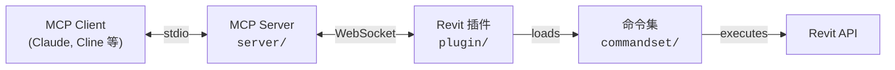

[](https://github.com/mcp-servers-for-revit/mcp-servers-for-revit)

# mcp-servers-for-revit

**通过 Model Context Protocol 将 AI 助手连接到 Autodesk Revit。**

[English README](./README.md)

`mcp-servers-for-revit` 让 Claude、Cline 以及其他兼容 MCP 的 AI 客户端能够读取、创建、修改和删除 Revit 项目中的元素。项目由三个部分组成：向 AI 暴露工具的 TypeScript MCP Server、在 Revit 内部运行并负责桥接命令的 C# 插件，以及真正执行 Revit API 操作的命令集。

> [!NOTE]
> 这是原始项目 [revit-mcp](https://github.com/mcp-servers-for-revit/revit-mcp) 的一个 fork，包含额外工具和功能增强。

## 架构



**MCP Server**（TypeScript）负责把 AI 客户端的工具调用转换为 WebSocket 消息。**Revit Plugin**（C#）运行在 Revit 进程内，监听这些消息，并把命令分发给 **Command Set**（C#）。后者执行实际的 Revit API 操作，并把结果沿链路返回。

## 环境要求

- **Node.js 18+**（MCP Server）
- **Autodesk Revit 2020 - 2026**（任一受支持版本）

## 快速开始（使用 Release）

1. 从 [Releases](https://github.com/mcp-servers-for-revit/mcp-servers-for-revit/releases) 页面下载对应 Revit 版本的 ZIP 包，例如 `mcp-servers-for-revit-v1.0.0-Revit2025.zip`

2. 解压后，将内容复制到 Revit Addins 目录：

   ```text
   %AppData%\Autodesk\Revit\Addins\<你的 Revit 版本>\
   ```

   复制完成后目录应类似于：

   ```text
   Addins/2025/
   ├── mcp-servers-for-revit.addin
   └── revit_mcp_plugin/
       ├── revit-mcp-plugin.dll
       ├── ...
       └── Commands/
           └── RevitMCPCommandSet/
               ├── command.json
               └── 2025/
                   ├── RevitMCPCommandSet.dll
                   └── ...
   ```

3. 在你的 AI 客户端中配置 MCP Server
4. 启动 Revit，插件会自动加载

## MCP Server 配置

MCP Server 已发布为 npm 包，可以直接通过 `npx` 运行。

**Claude Code**

```bash
claude mcp add mcp-server-for-revit -- cmd /c npx -y mcp-server-for-revit
```

**Claude Desktop**

Claude Desktop -> Settings -> Developer -> Edit Config -> `claude_desktop_config.json`：

```json
{
  "mcpServers": {
    "mcp-server-for-revit": {
      "command": "cmd",
      "args": ["/c", "npx", "-y", "mcp-server-for-revit"]
    }
  }
}
```

重启 Claude Desktop。看到锤子图标后，表示 MCP Server 已连接。


## Revit Plugin 安装

如果使用 release ZIP，插件已包含在内。手动安装时：

1. 构建 `plugin/` 项目，见 [开发](#开发)
2. 将 `mcp-servers-for-revit.addin` 复制到 `%AppData%\Autodesk\Revit\Addins\<version>\`
3. 将 `revit_mcp_plugin/` 整个目录复制到同一 Addins 目录

## Command Set 安装

如果使用 release ZIP，command set 已预装在插件目录中。手动安装时：

1. 构建 `commandset/` 项目，见 [开发](#开发)
2. 在插件安装目录下创建 `Commands/RevitMCPCommandSet/<year>/`
3. 将构建出的 DLL 复制到该目录
4. 将仓库根目录的 `command.json` 复制到 `Commands/RevitMCPCommandSet/`

构建 `commandset` 后，输出目录还会生成一份可直接复制的完整布局：

```text
<commandset 输出目录>\Commands\RevitMCPCommandSet\
  command.json
  <year>\
    RevitMCPCommandSet.dll
    ...
```

## 工具模式

Phase 1 默认让 MCP Server 以 `Code Mode` 启动。在该模式下，面向 AI 的工具面被收敛为：

| 工具 | 说明 |
| ---- | ---- |
| `search` | 查询预构建的 Revit API 索引，为 Code Mode 提供参考 |
| `execute` | 通过 Revit 桥接执行生成的 C# 代码 |

这意味着 `search -> execute` 是当前推荐的动态 Revit 自动化路径。

如需在迁移期间重新启用原有 15+ 工具，可这样启动：

```bash
REVIT_MCP_TOOLSET=full npx -y mcp-server-for-revit
```

或：

```bash
REVIT_MCP_ENABLE_LEGACY_TOOLS=true npx -y mcp-server-for-revit
```

兼容旧客户端的 `send_code_to_revit` 只在 full 模式下可见，并会被转发到新的插件命令名 `execute`。

## 支持的工具

### 默认 Code Mode

| 工具 | 说明 |
| ---- | ---- |
| `search` | 查询预构建的 Revit API 索引，为 Code Mode 提供参考 |
| `execute` | 通过 Revit 桥接执行生成的 C# 代码 |

### Legacy Full Mode

设置 `REVIT_MCP_TOOLSET=full` 后，会恢复原始工具面：

- `get_current_view_info`
- `get_current_view_elements`
- `get_available_family_types`
- `get_selected_elements`
- `get_material_quantities`
- `ai_element_filter`
- `analyze_model_statistics`
- `create_point_based_element`
- `create_line_based_element`
- `create_surface_based_element`
- `create_grid`
- `create_level`
- `create_room`
- `create_dimensions`
- `create_structural_framing_system`
- `delete_element`
- `operate_element`
- `color_elements`
- `tag_all_walls`
- `tag_all_rooms`
- `export_room_data`
- `store_project_data`
- `store_room_data`
- `query_stored_data`
- `send_code_to_revit`
- `say_hello`

## Phase 1 冒烟测试

推荐的端到端冒烟测试是通过 `execute` 弹出一个可见对话框：

```csharp
TaskDialog.Show("Revit MCP", "Hello Revit");
return new { message = "Hello Revit" };
```

如果你的客户端暴露了 `mode` 参数，请使用 `legacy`。当前默认执行模式也已经切换为 `legacy`，以兼容现阶段插件行为。

预期结果：

- MCP Server 调用 plugin 端命令 `execute`
- Revit 弹出 `Hello Revit` 对话框
- 工具响应返回成功结果

## 测试

测试项目使用 [Nice3point.TUnit.Revit](https://github.com/Nice3point/RevitUnit) 对真实 Revit 实例运行集成测试。不需要额外安装测试 addin，框架会自动注入到运行中的 Revit 进程。

### 前置条件

- **.NET 10 SDK**：`Nice3point.Revit.Sdk 6.1.0` 需要，安装命令为 `winget install Microsoft.DotNet.SDK.10`
- **Autodesk Revit 2026**（或 2025）：需要已安装并可正常授权

### 运行测试

1. 启动 Revit 2026（或 2025）并等待完全加载
2. 在命令行运行：

```bash
# Revit 2026
dotnet test -c Debug.R26 -r win-x64 tests/commandset

# Revit 2025
dotnet test -c Debug.R25 -r win-x64 tests/commandset
```

> **Note:** 在 ARM64 机器上需要 `-r win-x64`，因为 Revit API 程序集仅提供 x64 版本。

也可以使用 `dotnet run`：

```bash
cd tests/commandset
dotnet run -c Debug.R26
```

### IDE 支持

- **JetBrains Rider**：在 `Settings > Build, Execution, Deployment > Unit Testing > Testing Platform` 中启用 `Testing Platform support`
- **Visual Studio**：测试通常可通过标准的 Test Explorer 发现

### 测试结构

| 目录 | 用途 |
| ---- | ---- |
| `tests/commandset/AssemblyInfo.cs` | 全局 `[assembly: TestExecutor<RevitThreadExecutor>]` 注册 |
| `tests/commandset/Architecture/` | 创建楼层和房间相关测试 |
| `tests/commandset/DataExtraction/` | 模型统计、房间导出、材料统计测试 |
| `tests/commandset/ColorSplashTests.cs` | 颜色覆盖相关测试 |
| `tests/commandset/TagRoomsTests.cs` | 房间标注相关测试 |

### 编写新测试

测试类继承自 `RevitApiTest`，并使用 TUnit 的异步断言 API：

```csharp
public class MyTests : RevitApiTest
{
    private static Document _doc;

    [Before(HookType.Class)]
    [HookExecutor<RevitThreadExecutor>]
    public static void Setup()
    {
        _doc = Application.NewProjectDocument(UnitSystem.Imperial);
    }

    [After(HookType.Class)]
    [HookExecutor<RevitThreadExecutor>]
    public static void Cleanup()
    {
        _doc?.Close(false);
    }

    [Test]
    public async Task MyTest_Condition_ExpectedResult()
    {
        var elements = new FilteredElementCollector(_doc)
            .WhereElementIsNotElementType()
            .ToElements();

        await Assert.That(elements.Count).IsGreaterThan(0);
    }
}
```

## 开发

### MCP Server

```bash
cd server
npm install
npm run build
```

Server 会将 TypeScript 编译到 `server/build/`。开发过程中也可以直接运行 `npx tsx server/src/index.ts`。

### Revit Plugin + Command Set

使用 Visual Studio 打开 `mcp-servers-for-revit.sln`。该 solution 同时包含 plugin 和 commandset 项目。构建配置覆盖 Revit 2020-2026：

- **Revit 2020-2024**：.NET Framework 4.8（`Release R20` 到 `Release R24`）
- **Revit 2025-2026**：.NET 8（`Release R25`、`Release R26`）

构建 solution 后，会在 `plugin/bin/AddIn <year> <config>/` 下自动生成完整可部署布局；其中 command set 会自动复制到 plugin 的 `Commands/` 目录中。

## 项目结构

```text
mcp-servers-for-revit/
├── mcp-servers-for-revit.sln    # 组合 solution（plugin + commandset + tests）
├── command.json                 # Command set 清单
├── server/                      # MCP server（TypeScript），对 AI 暴露工具
├── plugin/                      # Revit add-in（C#），Revit 内部的 WebSocket 桥
├── commandset/                  # 命令实现（C#），实际 Revit API 操作
├── tests/                       # 集成测试（C#），针对真实 Revit 的 TUnit 测试
├── assets/                      # 文档图片资源
├── .github/                     # CI/CD 工作流、贡献指南、行为准则
├── LICENSE
└── README.md
```

## 发布

单个 `v*` tag 会驱动整套发布流程。[release workflow](.github/workflows/release.yml) 会自动：

- 为 Revit 2020-2026 构建 plugin + command set
- 创建 GitHub Release，并上传 `mcp-servers-for-revit-vX.Y.Z-Revit<year>.zip`
- 将 MCP Server 发布到 npm：[`mcp-server-for-revit`](https://www.npmjs.com/package/mcp-server-for-revit)

创建 release 的步骤：

1. 运行版本脚本，它会更新 `server/package.json`、`server/package-lock.json` 和 `plugin/Properties/AssemblyInfo.cs`，然后提交并打 tag：

   ```powershell
   ./scripts/release.ps1 -Version X.Y.Z
   ```

2. 推送代码和 tag，触发工作流：

   ```bash
   git push origin main --tags
   ```

> [!NOTE]
> npm 发布通过 OIDC 的 [trusted publishing](https://docs.npmjs.com/trusted-publishers/) 完成，不需要 npm token，供应链 provenance 证明会自动生成。

## 致谢

本项目 fork 自 [mcp-servers-for-revit](https://github.com/mcp-servers-for-revit) 团队的工作，原始仓库包括：

- [revit-mcp](https://github.com/mcp-servers-for-revit/revit-mcp) - MCP Server
- [revit-mcp-plugin](https://github.com/mcp-servers-for-revit/revit-mcp-plugin) - Revit 插件
- [revit-mcp-commandset](https://github.com/mcp-servers-for-revit/revit-mcp-commandset) - 命令集

感谢原作者提供了这个项目的基础。

## 许可证

[MIT](LICENSE)
