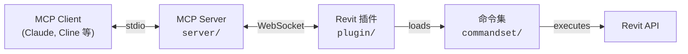

[](https://github.com/mcp-servers-for-revit/mcp-servers-for-revit)

# mcp-servers-for-revit

**通过 Model Context Protocol 将 AI 助手连接到 Autodesk Revit。**

[English README](./README.md)

`mcp-servers-for-revit` 让兼容 MCP 的 AI 客户端（Claude、Cline 等）能够通过本地桥接来检查和操作 Revit 模型。

它包含三个组成部分：

- `server/`（TypeScript）：面向 AI 客户端的 MCP Server 和工具接口
- `plugin/`（C#）：运行在 Revit 内部、承载桥接服务的插件
- `commandset/`（C#）：由插件调用、真正执行 Revit API 逻辑的命令实现

> [!NOTE]
> 本仓库是 [revit-mcp](https://github.com/mcp-servers-for-revit/revit-mcp) 的一个 fork，扩展了工具能力并更新了工作流。

## 架构



MCP Server 接收 AI 客户端的工具调用，并通过 WebSocket 转发桥接命令。Revit 插件负责把这些命令分发给命令集，后者执行 Revit API 逻辑并返回结构化结果。

## 环境要求

- **Node.js 18+**（MCP Server）
- **Autodesk Revit 2020-2026**

## 快速开始（Release ZIP）

1. 从 [Releases](https://github.com/mcp-servers-for-revit/mcp-servers-for-revit/releases) 下载与你的 Revit 版本对应的 ZIP 包。
2. 解压后，将文件复制到：

```text
%AppData%\Autodesk\Revit\Addins\<你的 Revit 版本>\
```

期望目录结构：

```text
Addins/2025/
├── mcp-servers-for-revit.addin
└── revit_mcp_plugin/
    ├── revit-mcp-plugin.dll
    ├── ...
    └── Commands/
        └── RevitMCPCommandSet/
            ├── command.json
            └── 2025/
                ├── RevitMCPCommandSet.dll
                └── ...
```

3. 在你的 AI 客户端中配置 MCP Server。
4. 启动 Revit（插件会自动加载）。

桥接运行时行为：

- Revit 初始化完成后，Socket 服务会在安全的空闲周期自动打开。
- Ribbon 按钮 `Revit MCP Switch` 用于切换 `Open / Close mcp server`。
- 由于启动时默认自动打开服务，第一次点击按钮会关闭服务。

## MCP Server 配置

MCP Server 已发布到 npm：[`mcp-server-for-revit`](https://www.npmjs.com/package/mcp-server-for-revit)。

### Claude Code

Windows：

```bash
claude mcp add mcp-server-for-revit -- cmd /c npx -y mcp-server-for-revit
```

macOS/Linux：

```bash
claude mcp add mcp-server-for-revit -- npx -y mcp-server-for-revit
```

### Claude Desktop

编辑 `claude_desktop_config.json`。

Windows：

```json
{
  "mcpServers": {
    "mcp-server-for-revit": {
      "command": "cmd",
      "args": ["/c", "npx", "-y", "mcp-server-for-revit"]
    }
  }
}
```

macOS/Linux：

```json
{
  "mcpServers": {
    "mcp-server-for-revit": {
      "command": "npx",
      "args": ["-y", "mcp-server-for-revit"]
    }
  }
}
```

重启客户端。如果出现锤子图标，说明 MCP 已连接成功。


## Revit 插件安装

如果你使用 release ZIP，插件文件已经包含在内。

手动安装：

1. 构建 `plugin/`（见 [开发](#开发)）。
2. 将 `mcp-servers-for-revit.addin` 复制到 `%AppData%\Autodesk\Revit\Addins\<version>\`。
3. 将 `revit_mcp_plugin/` 复制到同一个 Addins 目录。

## Command Set 安装

如果你使用 release ZIP，command set 文件也已经预置完成。

手动安装：

1. 构建 `commandset/`（见 [开发](#开发)）。
2. 在插件安装目录下创建 `Commands/RevitMCPCommandSet/<year>/`。
3. 将构建得到的 commandset DLL 复制到 `<year>/`。
4. 将仓库根目录的 `command.json` 复制到 `Commands/RevitMCPCommandSet/`。

预置输出结构：

```text
<commandset 输出目录>\Commands\RevitMCPCommandSet\
  command.json
  <year>\
    RevitMCPCommandSet.dll
    ...
```

## 工具模式

默认情况下，服务端以 **Code Mode** 启动（隐含 `REVIT_MCP_TOOLSET=code`）。

- Code Mode 暴露一组更聚焦的工具接口，用于更省 token 的检查流程和受控代码执行。
- Full Mode（`REVIT_MCP_TOOLSET=full` 或 `REVIT_MCP_ENABLE_LEGACY_TOOLS=true`）会额外暴露 `server/src/tools/` 中的 legacy 工具。

## 支持的工具（默认 Code Mode）

| 工具 | 作用 |
| ---- | ---- |
| `selection_roots` | 检查流程第 1 步：从当前选择集或活动视图发现根对象 |
| `object_member_groups` | 检查流程第 2 步：获取带继承层次的成员目录 |
| `expand_members` | 检查流程第 3 步：只展开被点名的成员 |
| `navigate_object` | 检查流程第 4 步：继续导航复杂值句柄 |
| `execute` | 后备/自定义 C# 执行工具（默认 `read_only`，仅在明确批准后使用 `modify`） |
| `get_runtime_context` | 运行时探针，用于桥接和执行上下文诊断 |
| `lookup_engine_query` | 运行时 API/成员发现工具，尤其适合符号名或成员名不确定时 |
| `search` | 紧凑型 API 补缺工具，仅用于补齐某个很窄的缺失细节 |
| `exec` | `execute` 的 legacy 别名 |

## 推荐工作流

建议按这个顺序决策：

1. **常规检查**：`selection_roots -> object_member_groups -> expand_members -> navigate_object`
2. **自定义分析或当前协议不支持的查询**：`execute`（先用 `read_only`）
3. **API/成员名不确定**：先用 `lookup_engine_query`，再修正并重试 `execute`
4. **最后一公里的 API 细节缺口**：调用一次 `search`，然后立刻回到 `execute`

补充说明：

- 简单任务通常应在 `0 次 search + 1 次 execute` 或纯 inspection flow 内完成。
- 只有在用户明确确认后，才应使用 `mode: "modify"`。

## RevitLookup 运行时说明

`lookup_engine_query` 和 inspection flow 依赖当前 Revit 进程中已加载相关程序集。

命令集会尝试自动加载：

- `RevitLookup.dll`
- `LookupEngine.dll`
- `LookupEngine.Abstractions.dll`

常见查找位置：

- `%AppData%\\Autodesk\\Revit\\Addins\\<year>\\RevitLookup\\`
- 插件输出目录同级的 `..\\RevitLookup`

如果运行时诊断仍然报告 lookup engine 不可用，请先在 Revit Ribbon 中手动打开一次 RevitLookup，再重试。

句柄生命周期：

- `objectHandle` 和 `valueHandle` 只在当前会话内有效，并且依赖当前上下文。
- 像 `WALL_HANDLE_NEW` 这样的占位句柄是故意无效的，会返回 `ERR_INVALID_HANDLE`。
- 如果文档、选择集或上下文发生变化，请重新调用 `selection_roots` 获取新句柄。

成员展开说明：

- `object_member_groups` 可能包含带签名预览的成员名，例如 `FindInserts (Boolean, Boolean, Boolean, Boolean)`。
- `expand_members` 支持按成员名和标准化后的签名形式进行匹配。

## 冒烟测试（Phase 1）

使用 `execute` 弹出一个可见对话框：

```csharp
TaskDialog.Show("Revit MCP", "Hello Revit");
return new { message = "Hello Revit" };
```

预期结果：

- MCP Server 发送桥接命令 `exec`（必要时回退到 `execute`）。
- Revit 弹出 `Hello Revit` 对话框。
- `execute` 返回成功 payload。

## 测试

测试套件使用 [Nice3point.TUnit.Revit](https://github.com/Nice3point/RevitUnit) 对真实运行中的 Revit 进程执行集成测试。

### 前置条件

- **.NET 10 SDK**（`Nice3point.Revit.Sdk 6.1.0` 的要求）
- **Revit 2026**（或 2025），并已正确安装和授权

### 运行测试

1. 打开 Revit 2026（或 2025）。
2. 运行：

```bash
# Revit 2026
dotnet test -c Debug.R26 -r win-x64 tests/commandset

# Revit 2025
dotnet test -c Debug.R25 -r win-x64 tests/commandset
```

> **Note:** 在 ARM64 机器上必须使用 `-r win-x64`，因为 Revit API 程序集只提供 x64 版本。

可选方式：

```bash
cd tests/commandset
dotnet run -c Debug.R26
```

### IDE 支持

- **JetBrains Rider**：启用 Testing Platform support
- **Visual Studio**：使用 Test Explorer

### 测试结构

| 目录 | 用途 |
|-----------|---------|
| `tests/commandset/AssemblyInfo.cs` | 全局 `[assembly: TestExecutor<RevitThreadExecutor>]` 注册 |
| `tests/commandset/Architecture/` | 楼层和房间创建测试 |
| `tests/commandset/DataExtraction/` | 模型统计、房间导出、材料数量测试 |
| `tests/commandset/ColorSplashTests.cs` | 颜色覆盖测试 |
| `tests/commandset/TagRoomsTests.cs` | 房间标注测试 |
| `tests/commandset/ConnectRvtLookup/` | RevitLookup 检查协议测试 |

### 编写新测试

```csharp
public class MyTests : RevitApiTest
{
    private static Document _doc;

    [Before(HookType.Class)]
    [HookExecutor<RevitThreadExecutor>]
    public static void Setup()
    {
        _doc = Application.NewProjectDocument(UnitSystem.Imperial);
    }

    [After(HookType.Class)]
    [HookExecutor<RevitThreadExecutor>]
    public static void Cleanup()
    {
        _doc?.Close(false);
    }

    [Test]
    public async Task MyTest_Condition_ExpectedResult()
    {
        var elements = new FilteredElementCollector(_doc)
            .WhereElementIsNotElementType()
            .ToElements();

        await Assert.That(elements.Count).IsGreaterThan(0);
    }
}
```

## 开发

### MCP Server

```bash
cd server
npm install
npm run build
```

编译输出目录：`server/build/`

开发时可直接运行：

```bash
npx tsx server/src/index.ts
```

### Revit 插件 + Command Set

使用 Visual Studio 打开 `mcp-servers-for-revit.sln`。

构建目标：

- Revit 2020-2024：.NET Framework 4.8（`Release R20`-`Release R24`）
- Revit 2025-2026：.NET 8（`Release R25`、`Release R26`）

构建输出会自动生成可部署目录：

- `plugin/bin/AddIn <year> <config>/`

`RevitMCPPlugin.csproj` 依赖 `RevitMCPCommandSet.csproj`，因此构建插件时会自动先构建 command set 并完成产物整理。

## 项目结构

```text
mcp-servers-for-revit/
├── mcp-servers-for-revit.sln
├── command.json
├── server/
├── plugin/
├── commandset/
├── tests/
├── docs/
├── assets/
├── .github/
├── scripts/
├── LICENSE
└── README.md
```

## 发布

单个 `v*` tag 会驱动完整发布流程（[` .github/workflows/release.yml`](.github/workflows/release.yml)）：

- 构建 Revit 2020-2026 的 plugin + commandset
- 创建 GitHub Release ZIP 资产
- 通过 trusted publishing（OIDC）发布 npm 包 `mcp-server-for-revit`

发布步骤：

1. 升级版本并打 tag：

```powershell
./scripts/release.ps1 -Version X.Y.Z
```

2. 推送：

```bash
git push origin main --tags
```

> [!NOTE]
> `release.ps1` 当前会在版本提升前对本地改动执行 hard reset。只应在工作区干净或可丢弃的树上运行。

## 致谢

本项目建立在 [mcp-servers-for-revit](https://github.com/mcp-servers-for-revit) 团队的原始工作之上：

- [revit-mcp](https://github.com/mcp-servers-for-revit/revit-mcp)
- [revit-mcp-plugin](https://github.com/mcp-servers-for-revit/revit-mcp-plugin)
- [revit-mcp-commandset](https://github.com/mcp-servers-for-revit/revit-mcp-commandset)

## 许可证

[MIT](LICENSE)
