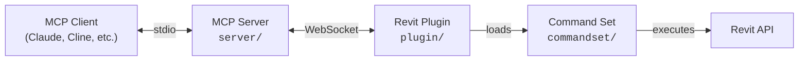

[](https://github.com/mcp-servers-for-revit/mcp-servers-for-revit)

# mcp-servers-for-revit

**Connect AI assistants to Autodesk Revit via the Model Context Protocol.**

[中文说明](./README-zh.md)

`mcp-servers-for-revit` enables MCP-compatible AI clients (Claude, Cline, etc.) to inspect and operate Revit models through a local bridge.

It contains three components:

- `server/` (TypeScript): MCP server and tool surface for AI clients
- `plugin/` (C#): Revit add-in that hosts the bridge inside Revit
- `commandset/` (C#): Revit API command implementations invoked by the plugin

> [!NOTE]
> This repository is a fork of [revit-mcp](https://github.com/mcp-servers-for-revit/revit-mcp) with expanded tooling and workflow updates.

## Architecture



The MCP server receives tool calls from the AI client and forwards bridge commands over WebSocket. The Revit plugin dispatches those commands into the command set, which runs Revit API logic and returns structured results.

## Requirements

- **Node.js 18+** (MCP server)
- **Autodesk Revit 2020-2026**

## Quick Start (Release ZIP)

1. Download a release ZIP for your Revit version from [Releases](https://github.com/mcp-servers-for-revit/mcp-servers-for-revit/releases).
2. Extract and copy files into:

```text
%AppData%\Autodesk\Revit\Addins\<your Revit version>\
```

Expected structure:

```text
Addins/2025/
├── mcp-servers-for-revit.addin
└── revit_mcp_plugin/
    ├── revit-mcp-plugin.dll
    ├── ...
    └── Commands/
        └── RevitMCPCommandSet/
            ├── command.json
            └── 2025/
                ├── RevitMCPCommandSet.dll
                └── ...
```

3. Configure the MCP server in your AI client.
4. Start Revit (plugin auto-loads).

Bridge runtime behavior:

- Socket service auto-opens after Revit initialization on a safe idle cycle.
- Ribbon button `Revit MCP Switch` toggles `Open / Close mcp server`.
- Because startup auto-opens the server, the first click will close it.

## MCP Server Setup

The MCP server is published on npm as [`mcp-server-for-revit`](https://www.npmjs.com/package/mcp-server-for-revit).

### Claude Code

Windows:

```bash
claude mcp add mcp-server-for-revit -- cmd /c npx -y mcp-server-for-revit
```

macOS/Linux:

```bash
claude mcp add mcp-server-for-revit -- npx -y mcp-server-for-revit
```

### Claude Desktop

Edit `claude_desktop_config.json`.

Windows:

```json
{
  "mcpServers": {
    "mcp-server-for-revit": {
      "command": "cmd",
      "args": ["/c", "npx", "-y", "mcp-server-for-revit"]
    }
  }
}
```

macOS/Linux:

```json
{
  "mcpServers": {
    "mcp-server-for-revit": {
      "command": "npx",
      "args": ["-y", "mcp-server-for-revit"]
    }
  }
}
```

Restart the client. If the hammer icon is visible, MCP connection is active.


## Revit Plugin Setup

If you use release ZIP assets, plugin files are already included.

Manual setup:

1. Build `plugin/` (see [Development](#development)).
2. Copy `mcp-servers-for-revit.addin` to `%AppData%\Autodesk\Revit\Addins\<version>\`.
3. Copy `revit_mcp_plugin/` to the same addins directory.

## Command Set Setup

If you use release ZIP assets, command set files are already staged.

Manual setup:

1. Build `commandset/` (see [Development](#development)).
2. Create `Commands/RevitMCPCommandSet/<year>/` under plugin install directory.
3. Copy built commandset DLLs into `<year>/`.
4. Copy repo-root `command.json` into `Commands/RevitMCPCommandSet/`.

Staged output layout:

```text
<commandset output>\Commands\RevitMCPCommandSet\
  command.json
  <year>\
    RevitMCPCommandSet.dll
    ...
```

## Tool Modes

By default, the server starts in **Code Mode** (`REVIT_MCP_TOOLSET=code` implied).

- Code Mode exposes a focused tool surface for token-efficient inspection and controlled code execution.
- Full Mode (`REVIT_MCP_TOOLSET=full` or `REVIT_MCP_ENABLE_LEGACY_TOOLS=true`) additionally exposes legacy tools from `server/src/tools/`.

## Supported Tools (Default Code Mode)

| Tool | Role |
| ---- | ---- |
| `selection_roots` | Inspection step 1: discover roots from selection or active view |
| `object_member_groups` | Inspection step 2: get inheritance-aware member directories |
| `expand_members` | Inspection step 3: expand only named members |
| `navigate_object` | Inspection step 4: navigate complex value handles |
| `execute` | Fallback/custom C# execution (`read_only` default, `modify` with explicit approval only) |
| `get_runtime_context` | Runtime probe for bridge and execution context diagnostics |
| `lookup_engine_query` | Runtime API/member discovery helper (especially for symbol/member uncertainty) |
| `search` | Compact API gap-filler, used only for narrow missing details |
| `exec` | Legacy alias of `execute` |

## Recommended Workflow

Use this decision order:

1. **Routine inspection**: `selection_roots -> object_member_groups -> expand_members -> navigate_object`
2. **Custom analysis or unsupported query**: `execute` (`read_only` first)
3. **API/member uncertainty**: `lookup_engine_query` first, then patch and retry `execute`
4. **Last-mile API detail**: `search` once, then immediately retry `execute`

Guidance:

- Simple tasks should usually finish with `0 x search + 1 x execute` or pure inspection flow.
- `mode: "modify"` should only be used after explicit user confirmation.

## RevitLookup Runtime Notes

`lookup_engine_query` and the inspection flow require assemblies loaded in the current Revit process.

The command set attempts to auto-load:

- `RevitLookup.dll`
- `LookupEngine.dll`
- `LookupEngine.Abstractions.dll`

Common lookup locations:

- `%AppData%\\Autodesk\\Revit\\Addins\\<year>\\RevitLookup\\`
- plugin output sibling `..\\RevitLookup`

If runtime diagnostics still report unavailable lookup engine, open RevitLookup once in Revit ribbon and retry.

Handle lifecycle:

- `objectHandle` / `valueHandle` are session-scoped and context-sensitive.
- Placeholder handles such as `WALL_HANDLE_NEW` are intentionally invalid and return `ERR_INVALID_HANDLE`.
- If document/selection/context changes, refresh via `selection_roots` and use new handles.

Member expansion notes:

- `object_member_groups` can include signature previews such as `FindInserts (Boolean, Boolean, Boolean, Boolean)`.
- `expand_members` supports name and signature-normalized matching.

## Smoke Test (Phase 1)

Use `execute` with a visible dialog:

```csharp
TaskDialog.Show("Revit MCP", "Hello Revit");
return new { message = "Hello Revit" };
```

Expected:

- MCP server sends bridge command `exec` (with fallback to `execute` if needed).
- Revit shows `Hello Revit` dialog.
- `execute` returns a success payload.

## Testing

The test suite uses [Nice3point.TUnit.Revit](https://github.com/Nice3point/RevitUnit) for integration testing against a live Revit process.

### Prerequisites

- **.NET 10 SDK** (`Nice3point.Revit.Sdk 6.1.0` requirement)
- **Revit 2026** (or 2025), installed and licensed

### Run Tests

1. Open Revit 2026 (or 2025).
2. Run:

```bash
# Revit 2026
dotnet test -c Debug.R26 -r win-x64 tests/commandset

# Revit 2025
dotnet test -c Debug.R25 -r win-x64 tests/commandset
```

> **Note:** `-r win-x64` is required on ARM64 machines because Revit API assemblies are x64-only.

Alternative:

```bash
cd tests/commandset
dotnet run -c Debug.R26
```

### IDE Support

- **JetBrains Rider**: enable Testing Platform support
- **Visual Studio**: use Test Explorer

### Test Structure

| Directory | Purpose |
|-----------|---------|
| `tests/commandset/AssemblyInfo.cs` | Global `[assembly: TestExecutor<RevitThreadExecutor>]` registration |
| `tests/commandset/Architecture/` | Level and room creation tests |
| `tests/commandset/DataExtraction/` | Model statistics, room export, material quantity tests |
| `tests/commandset/ColorSplashTests.cs` | Color override tests |
| `tests/commandset/TagRoomsTests.cs` | Room tagging tests |
| `tests/commandset/ConnectRvtLookup/` | RevitLookup inspection protocol tests |

### Writing New Tests

```csharp
public class MyTests : RevitApiTest
{
    private static Document _doc;

    [Before(HookType.Class)]
    [HookExecutor<RevitThreadExecutor>]
    public static void Setup()
    {
        _doc = Application.NewProjectDocument(UnitSystem.Imperial);
    }

    [After(HookType.Class)]
    [HookExecutor<RevitThreadExecutor>]
    public static void Cleanup()
    {
        _doc?.Close(false);
    }

    [Test]
    public async Task MyTest_Condition_ExpectedResult()
    {
        var elements = new FilteredElementCollector(_doc)
            .WhereElementIsNotElementType()
            .ToElements();

        await Assert.That(elements.Count).IsGreaterThan(0);
    }
}
```

## Development

### MCP Server

```bash
cd server
npm install
npm run build
```

Compiled output: `server/build/`

Dev run:

```bash
npx tsx server/src/index.ts
```

### Revit Plugin + Command Set

Open `mcp-servers-for-revit.sln` in Visual Studio.

Build targets:

- Revit 2020-2024: .NET Framework 4.8 (`Release R20`-`Release R24`)
- Revit 2025-2026: .NET 8 (`Release R25`, `Release R26`)

Build output includes deploy-ready layout in:

- `plugin/bin/AddIn <year> <config>/`

`RevitMCPPlugin.csproj` depends on `RevitMCPCommandSet.csproj`, so command set output is staged automatically.

## Project Structure

```text
mcp-servers-for-revit/
├── mcp-servers-for-revit.sln
├── command.json
├── server/
├── plugin/
├── commandset/
├── tests/
├── docs/
├── assets/
├── .github/
├── scripts/
├── LICENSE
└── README.md
```

## Releasing

A single `v*` tag drives the full release pipeline ([`.github/workflows/release.yml`](.github/workflows/release.yml)):

- Build plugin + commandset for Revit 2020-2026
- Create GitHub release ZIP assets
- Publish npm package `mcp-server-for-revit` via trusted publishing (OIDC)

Release steps:

1. Bump versions and tag:

```powershell
./scripts/release.ps1 -Version X.Y.Z
```

2. Push:

```bash
git push origin main --tags
```

> [!NOTE]
> `release.ps1` currently performs a hard reset of local changes before bumping. Run it only from a clean or disposable working tree.

## Acknowledgements

This project builds on the original work from the [mcp-servers-for-revit](https://github.com/mcp-servers-for-revit) team:

- [revit-mcp](https://github.com/mcp-servers-for-revit/revit-mcp)
- [revit-mcp-plugin](https://github.com/mcp-servers-for-revit/revit-mcp-plugin)
- [revit-mcp-commandset](https://github.com/mcp-servers-for-revit/revit-mcp-commandset)

## License

[MIT](LICENSE)
