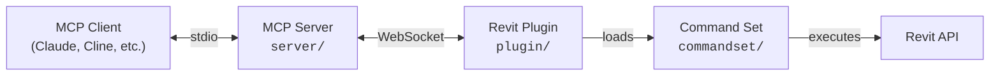

[](https://github.com/mcp-servers-for-revit/mcp-servers-for-revit)

# mcp-servers-for-revit

**Connect AI assistants to Autodesk Revit via the Model Context Protocol.**

[中文说明](./README-zh.md)

mcp-servers-for-revit enables AI clients like Claude, Cline, and other MCP-compatible tools to read, create, modify, and delete elements in Revit projects. It consists of three components: a TypeScript MCP server that exposes tools to AI, a C# Revit add-in that bridges commands into Revit, and a command set that implements the actual Revit API operations.

> [!NOTE]
> This is a fork of the original [revit-mcp](https://github.com/mcp-servers-for-revit/revit-mcp) project with additional tools and functionality improvements.

## Architecture



The **MCP Server** (TypeScript) translates tool calls from AI clients into WebSocket messages. The **Revit Plugin** (C#) runs inside Revit, listens for those messages, and dispatches them to the **Command Set** (C#), which executes the actual Revit API operations and returns results back up the chain.

## Requirements

- **Node.js 18+** (for the MCP server)
- **Autodesk Revit 2020 - 2026** (any supported version)

## Quick Start (Using a Release)

1. Download the ZIP for your Revit version from the [Releases](https://github.com/mcp-servers-for-revit/mcp-servers-for-revit/releases) page (e.g., `mcp-servers-for-revit-v1.0.0-Revit2025.zip`)

2. Extract the ZIP and copy the contents to your Revit addins folder:
   ```
   %AppData%\Autodesk\Revit\Addins\<your Revit version>\
   ```
   After copying you should have:
   ```
   Addins/2025/
   ├── mcp-servers-for-revit.addin
   └── revit_mcp_plugin/
       ├── revit-mcp-plugin.dll
       ├── ...
       └── Commands/
           └── RevitMCPCommandSet/
               ├── command.json
               └── 2025/
                   ├── RevitMCPCommandSet.dll
                   └── ...
   ```

3. Configure the MCP server in your AI client (see below)

4. Start Revit - the plugin loads automatically

## MCP Server Setup

The MCP server is published as an npm package and can be run directly with `npx`.

**Claude Code**

```bash
claude mcp add mcp-server-for-revit -- cmd /c npx -y mcp-server-for-revit
```

**Claude Desktop**

Claude Desktop → Settings → Developer → Edit Config → `claude_desktop_config.json`:

```json
{
    "mcpServers": {
        "mcp-server-for-revit": {
            "command": "cmd",
            "args": ["/c", "npx", "-y", "mcp-server-for-revit"]
        }
    }
}
```

Restart Claude Desktop. When you see the hammer icon, the MCP server is connected.


## Revit Plugin Setup

If using a release ZIP, the plugin is already included. For manual installation:

1. Build the plugin from `plugin/` (see [Development](#development))
2. Copy `mcp-servers-for-revit.addin` to `%AppData%\Autodesk\Revit\Addins\<version>\`
3. Copy the `revit_mcp_plugin/` folder to the same addins directory

## Command Set Setup

If using a release ZIP, the command set is pre-installed inside the plugin. For manual installation:

1. Build the command set from `commandset/` (see [Development](#development))
2. Inside the plugin's installation directory, create `Commands/RevitMCPCommandSet/<year>/`
3. Copy the built DLLs into that folder
4. Copy `command.json` (from repo root) into `Commands/RevitMCPCommandSet/`

After building `commandset`, the output directory also contains a staged layout you can copy directly:

```text
<commandset output>\Commands\RevitMCPCommandSet\
  command.json
  <year>\
    RevitMCPCommandSet.dll
    ...
```

## Tool Modes

Phase 1 now defaults the MCP server to `Code Mode`. In this mode, the AI-facing tool surface is intentionally reduced to:

| Tool | Description |
| ---- | ----------- |
| `search` | Search the prebuilt Revit API index for Code Mode guidance |
| `exec` | Execute generated C# in `read_only` or `modify` mode through the Revit bridge |

This makes `search -> exec` the preferred path for dynamic Revit inspection and controlled edits.

## Supported Tools

### Default Code Mode

| Tool | Description |
| ---- | ----------- |
| `search` | Search the prebuilt Revit API index for Code Mode guidance |
| `exec` | Execute generated C# in `read_only` or `modify` mode through the Revit bridge |

`exec` defaults to `read_only` for inspection and analysis.

Use `mode: "modify"` only after the user explicitly confirms that the model should be changed.

## Phase 1 Smoke Test

The recommended end-to-end smoke test is `exec` with a visible dialog:

```csharp
TaskDialog.Show("Revit MCP", "Hello Revit");
return new { message = "Hello Revit" };
```

If your client exposes the `mode` argument, use `read_only` by default. Switch to `modify` only after explicit user approval for model changes.

Expected outcome:

- The MCP server calls the plugin bridge command `exec`.
- Revit displays a `Hello Revit` dialog.
- The tool response contains a success payload.

## Testing

The test project uses [Nice3point.TUnit.Revit](https://github.com/Nice3point/RevitUnit) to run integration tests against a live Revit instance. No separate addin installation is required — the framework injects into the running Revit process automatically.

### Prerequisites

- **.NET 10 SDK** — required by Nice3point.Revit.Sdk 6.1.0. Install via `winget install Microsoft.DotNet.SDK.10`
- **Autodesk Revit 2026** (or 2025) — must be installed and licensed on your machine

### Running Tests

1. Open Revit 2026 (or 2025) and wait for it to fully load
2. Run the tests from the command line:

```bash
# For Revit 2026
dotnet test -c Debug.R26 -r win-x64 tests/commandset

# For Revit 2025
dotnet test -c Debug.R25 -r win-x64 tests/commandset
```

> **Note:** The `-r win-x64` flag is required on ARM64 machines because the Revit API assemblies are x64-only.

Alternatively, you can use `dotnet run`:

```bash
cd tests/commandset
dotnet run -c Debug.R26
```

### IDE Support

- **JetBrains Rider** — enable "Testing Platform support" in Settings > Build, Execution, Deployment > Unit Testing > Testing Platform
- **Visual Studio** — tests should be discoverable through the standard Test Explorer

### Test Structure

| Directory | Purpose |
|-----------|---------|
| `tests/commandset/AssemblyInfo.cs` | Global `[assembly: TestExecutor<RevitThreadExecutor>]` registration |
| `tests/commandset/Architecture/` | Tests for level and room creation commands |
| `tests/commandset/DataExtraction/` | Tests for model statistics, room data export, and material quantities |
| `tests/commandset/ColorSplashTests.cs` | Tests for color override functionality |
| `tests/commandset/TagRoomsTests.cs` | Tests for room tagging functionality |

### Writing New Tests

Test classes inherit from `RevitApiTest` and use TUnit's async assertion API:

```csharp
public class MyTests : RevitApiTest
{
    private static Document _doc;

    [Before(HookType.Class)]
    [HookExecutor<RevitThreadExecutor>]
    public static void Setup()
    {
        _doc = Application.NewProjectDocument(UnitSystem.Imperial);
    }

    [After(HookType.Class)]
    [HookExecutor<RevitThreadExecutor>]
    public static void Cleanup()
    {
        _doc?.Close(false);
    }

    [Test]
    public async Task MyTest_Condition_ExpectedResult()
    {
        var elements = new FilteredElementCollector(_doc)
            .WhereElementIsNotElementType()
            .ToElements();

        await Assert.That(elements.Count).IsGreaterThan(0);
    }
}
```

## Development

### MCP Server

```bash
cd server
npm install
npm run build
```

The server compiles TypeScript to `server/build/`. During development you can run it directly with `npx tsx server/src/index.ts`.

### Revit Plugin + Command Set

Open `mcp-servers-for-revit.sln` in Visual Studio. The solution contains both the plugin and command set projects. Build configurations target Revit 2020-2026:

- **Revit 2020-2024**: .NET Framework 4.8 (`Release R20` through `Release R24`)
- **Revit 2025-2026**: .NET 8 (`Release R25`, `Release R26`)

Building the solution automatically assembles the complete deployable layout in `plugin/bin/AddIn <year> <config>/` - the command set is copied into the plugin's `Commands/` folder as part of the build.

`RevitMCPPlugin.csproj` now has an explicit project dependency on `RevitMCPCommandSet.csproj`, so building the plugin also builds the command set first and stages its output into the plugin add-in directory automatically.

For convenience, the command-set deployment layout is also copied into the plugin's standard output directory under `plugin/bin/<Config>/<year>/Commands/RevitMCPCommandSet/`.

## Project Structure

```
mcp-servers-for-revit/
├── mcp-servers-for-revit.sln    # Combined solution (plugin + commandset + tests)
├── command.json     # Command set manifest
├── server/          # MCP server (TypeScript) - tools exposed to AI clients
├── plugin/          # Revit add-in (C#) - WebSocket bridge inside Revit
├── commandset/      # Command implementations (C#) - Revit API operations
├── tests/           # Integration tests (C#) - TUnit tests against live Revit
├── assets/          # Images for documentation
├── .github/         # CI/CD workflows, contributing guide, code of conduct
├── LICENSE
└── README.md
```

## Releasing

A single `v*` tag drives the entire release. The [release workflow](.github/workflows/release.yml) automatically:

- Builds the Revit plugin + command set for Revit 2020-2026
- Creates a GitHub release with `mcp-servers-for-revit-vX.Y.Z-Revit<year>.zip` assets
- Publishes the MCP server to npm as [`mcp-server-for-revit`](https://www.npmjs.com/package/mcp-server-for-revit)

To create a release:

1. Run the bump script (updates `server/package.json`, `server/package-lock.json`, and `plugin/Properties/AssemblyInfo.cs`, then commits and tags):
   ```powershell
   ./scripts/release.ps1 -Version X.Y.Z
   ```

2. Push to trigger the workflow:
   ```bash
   git push origin main --tags
   ```

> [!NOTE]
> npm publish uses [trusted publishing](https://docs.npmjs.com/trusted-publishers/) via OIDC — no npm token is required. Provenance attestation is generated automatically.

## Acknowledgements

This project is a fork of the work by the [mcp-servers-for-revit](https://github.com/mcp-servers-for-revit) team. The original repositories:

- [revit-mcp](https://github.com/mcp-servers-for-revit/revit-mcp) - MCP server
- [revit-mcp-plugin](https://github.com/mcp-servers-for-revit/revit-mcp-plugin) - Revit plugin
- [revit-mcp-commandset](https://github.com/mcp-servers-for-revit/revit-mcp-commandset) - Command set

Thank you to the original authors for creating the foundation that this project builds upon.

## License

[MIT](LICENSE)
