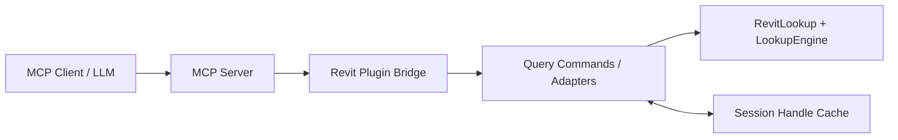

# Design Document

## Overview

本设计文档描述如何在 `mcp-servers-for-revit` 中接入 RevitLookup 的 decomposition 能力，构建一套低 token 的构件查询协议。

设计目标：

- 复用 RevitLookup 的根对象获取、类型分组、继承链成员分组、descriptor 映射能力。
- 通过 MCP 暴露“目录式、按需展开式”的查询接口。
- 让调用方在绝大多数 inspection 场景下不再依赖 `execute` 生成大段 C# 和大体量响应。

设计原则：

- 先目录，后取值，再导航。
- 先复用 RevitLookup，后补薄适配层。
- 默认返回结构化摘要，不默认返回全量值。
- 通过句柄在多跳浏览中复用服务端状态。

## Architecture

整体采用“RevitLookup 浏览内核 + MCP 查询适配层 + 会话句柄缓存”的三层架构。



架构分层说明：

1. RevitLookup / LookupEngine 层
   负责：
   - 根对象收集
   - 成员分解
   - 继承链分组
   - descriptor 重写与可导航对象生成

2. Query Adapter 层
   负责：
   - 根对象结果投影
   - 成员组摘要
   - 指定成员展开
   - 复杂值导航
   - token 预算裁剪

3. Session Handle Cache 层
   负责：
   - `objectHandle` / `valueHandle` 解析
   - 目录和展开结果缓存
   - 文档、选择集、模型上下文失效控制

## Components and Interfaces

### 1. Root Discovery Command

建议新增命令：`selection_roots`

职责：

- 复用 RevitLookup 根对象收集语义
- 以运行时 `TypeName` 分组返回根对象
- 返回最小识别字段和对象句柄

输入接口草案：

```json
{
  "source": "selection_or_active_view",
  "limitGroups": 20,
  "limitItemsPerGroup": 20,
  "tokenBudgetHint": 2000
}
```

输出接口草案：

```json
{
  "source": "selection_or_active_view",
  "totalRootCount": 42,
  "truncated": false,
  "groups": [
    {
      "groupKey": "Wall",
      "count": 12,
      "items": [
        {
          "objectHandle": "obj:1",
          "elementId": 12345,
          "uniqueId": "....",
          "title": "Basic Wall, ID12345",
          "typeName": "Wall",
          "category": "Walls"
        }
      ]
    }
  ]
}
```

### 2. Member Group Directory Command

建议新增命令：`object_member_groups`

职责：

- 基于单个对象返回继承链成员目录
- 默认只返回分组和预览成员，不返回成员值

输入接口草案：

```json
{
  "objectHandle": "obj:1",
  "limitGroups": 10,
  "limitMembersPerGroup": 12,
  "tokenBudgetHint": 1500
}
```

输出接口草案：

```json
{
  "objectHandle": "obj:1",
  "title": "Basic Wall, ID12345",
  "groups": [
    {
      "declaringTypeName": "Element",
      "depth": 1,
      "memberCount": 87,
      "topMembers": ["Id", "Name", "Category", "BoundingBox", "Geometry"],
      "hasMoreMembers": true
    }
  ]
}
```

### 3. Targeted Member Expansion Command

建议新增命令：`expand_members`

职责：

- 只展开调用方显式指定的成员
- 对简单值返回标量，对复杂值返回摘要和导航句柄

输入接口草案：

```json
{
  "objectHandle": "obj:1",
  "members": [
    { "declaringTypeName": "Wall", "memberName": "Width" },
    { "declaringTypeName": "Element", "memberName": "BoundingBox" }
  ],
  "tokenBudgetHint": 2000
}
```

输出接口草案：

```json
{
  "objectHandle": "obj:1",
  "expanded": [
    {
      "declaringTypeName": "Wall",
      "memberName": "Width",
      "valueKind": "scalar",
      "displayValue": "200"
    },
    {
      "declaringTypeName": "Element",
      "memberName": "BoundingBox",
      "valueKind": "object_summary",
      "displayValue": "Model + ActiveView",
      "canNavigate": true,
      "valueHandle": "val:1"
    }
  ]
}
```

### 4. Deep Navigation Command

建议新增命令：`navigate_object`

职责：

- 打开某个 descriptor 值或复杂值摘要对应的下一层对象
- 保持和 `object_member_groups` 相同的输出形状

输入接口草案：

```json
{
  "valueHandle": "val:1",
  "limitGroups": 10,
  "limitMembersPerGroup": 12,
  "tokenBudgetHint": 1500
}
```

### 5. Query Adapter Services

建议新增或抽取以下服务：

- `RevitLookupBridgeService`
  - 负责定位和调用 RevitLookup/LookupEngine 入口
  - 统一封装根对象获取、对象分解和 descriptor 访问

- `QueryProjectionService`
  - 负责将 RevitLookup 的内部对象模型投影成 MCP 输出 JSON
  - 统一处理 group、preview、summary、fallback 标记

- `QueryHandleStore`
  - 负责会话内对象和值句柄的注册、解析和失效

- `QueryBudgetService`
  - 负责根据 `tokenBudgetHint` 执行响应裁剪策略

### 6. RevitLookup Reuse Points

建议直接复用的逻辑：

- 根对象语义：`RevitObjectsCollector`
- 左侧分组语义：按 `TypeName` 分组
- 右侧成员分组语义：按 `DeclaringTypeName` + `Depth`
- 复杂值重写语义：`DescriptorsMap`、`ElementDescriptor` 等 descriptor

明确不重复建设的逻辑：

- 自定义构件 taxonomy
- 自定义全量成员继承树生成器
- 针对 `Geometry`、`BoundingBox`、`Parameter`、`Reference` 的大规模手写格式化

## Data Models

### Root Group

```csharp
public sealed class RootGroupResult
{
    public string GroupKey { get; set; }
    public int Count { get; set; }
    public List<RootItemResult> Items { get; set; }
}
```

### Root Item

```csharp
public sealed class RootItemResult
{
    public string ObjectHandle { get; set; }
    public long? ElementId { get; set; }
    public string UniqueId { get; set; }
    public string Title { get; set; }
    public string TypeName { get; set; }
    public string Category { get; set; }
}
```

### Member Group

```csharp
public sealed class MemberGroupResult
{
    public string DeclaringTypeName { get; set; }
    public int Depth { get; set; }
    public int MemberCount { get; set; }
    public List<string> TopMembers { get; set; }
    public bool HasMoreMembers { get; set; }
}
```

### Expanded Member

```csharp
public sealed class ExpandedMemberResult
{
    public string DeclaringTypeName { get; set; }
    public string MemberName { get; set; }
    public string ValueKind { get; set; }
    public string DisplayValue { get; set; }
    public bool CanNavigate { get; set; }
    public string ValueHandle { get; set; }
    public string ErrorMessage { get; set; }
    public bool UsedFallback { get; set; }
}
```

### Handle Entry

```csharp
public sealed class QueryHandleEntry
{
    public string Handle { get; set; }
    public string HandleType { get; set; }
    public string DocumentKey { get; set; }
    public object Value { get; set; }
    public DateTime CreatedAtUtc { get; set; }
}
```

### Budget Metadata

```csharp
public sealed class QueryBudgetMetadata
{
    public bool Truncated { get; set; }
    public string NextSuggestedAction { get; set; }
    public string TruncationStage { get; set; }
}
```

## Error Handling

错误处理策略遵循“局部失败可见、整体协议稳定”的原则。

### 1. Command-Level Errors

场景：

- 无活动文档
- 句柄无效
- RevitLookup 组件不可用
- 外部事件超时

策略：

- 返回结构化错误码和中文错误信息
- 不使用空 catch
- 写入符合项目规范的中文日志

建议错误码：

- `ERR_NO_ACTIVE_DOCUMENT`
- `ERR_INVALID_HANDLE`
- `ERR_LOOKUP_BRIDGE_UNAVAILABLE`
- `ERR_QUERY_TIMEOUT`
- `ERR_MEMBER_EXPANSION_FAILED`

### 2. Member-Level Errors

场景：

- 单个成员取值失败
- descriptor 解析失败
- 复杂值不可导航

策略：

- 将错误限制在单个成员结果内
- 其余成员继续返回
- 在成员结果中返回 `errorMessage` 和 `usedFallback`

### 3. Cache Invalidation Errors

场景：

- 文档切换
- 选择上下文失效
- 模型变更导致句柄指向对象不可用

策略：

- 返回明确失效错误
- 引导调用方重新从 `selection_roots` 开始获取最新上下文

### 4. Logging

日志规范：

- 使用中文描述
- 包含时间、级别、模块名、方法名和关键上下文
- 记录命令名、句柄、元素 ID、降级路径和异常栈

示例：

```text
[2026-03-26 10:15:30] Warning/connect-rvtLookup: [ExpandMembers] 成员展开失败，elementId=12345，member=Geometry，已回退为摘要输出。
```

## Testing Strategy

### 1. Unit Tests

针对纯适配和投影逻辑补充单元测试：

- `QueryProjectionService` 的分组和裁剪行为
- `QueryBudgetService` 的预算裁剪顺序
- `QueryHandleStore` 的注册、解析、失效逻辑

### 2. Integration Tests

针对命令层补充集成测试：

- 有选择集时 `selection_roots` 返回所选元素
- 无选择集时 `selection_roots` 回退到当前视图元素
- `object_member_groups` 能按 `DeclaringTypeName` 正确分组
- `expand_members` 对简单值和复杂值输出不同形状
- `navigate_object` 能打开 descriptor 对象的下一层成员页

### 3. Regression Tests

增加回归测试覆盖：

- RevitLookup 不可用时的 fallback 行为
- 句柄失效后的错误输出
- 成员局部失败不影响整体响应

### 4. Token-Oriented Assertions

虽然不在测试中直接计算 LLM token，但应通过结构断言保证“低 token 默认路径”成立：

- 第一步接口不返回成员值
- 成员目录接口不返回成员值
- 复杂值默认返回摘要和句柄
- 大结果会带 `truncated` 标记

## Design Decisions and Rationale

### Decision 1: 复用 RevitLookup 的浏览模型，而不是重做静态树

原因：

- RevitLookup 已经验证过这种结构适合复杂对象浏览
- 减少我们维护自定义 hierarchy 的成本
- 与实际 UI 和运行时认知保持一致

### Decision 2: 新增专用查询命令，而不是继续依赖 `execute`

原因：

- `execute` 灵活但太重
- inspection 场景需要稳定 schema，而不是动态 C#
- 有利于做预算控制、缓存和错误隔离

### Decision 3: 句柄优先于内联深展开

原因：

- 复杂值深展开是 token 主要来源
- 句柄便于多跳查询和会话缓存
- 更接近 RevitLookup 的“点击后打开下一层”交互方式

### Decision 4: descriptor-first，fallback-second

原因：

- descriptor 已经封装了对复杂 Revit 类型的浏览逻辑
- 避免我们重复写大规模类型适配
- 保留 fallback 可以降低接入风险
